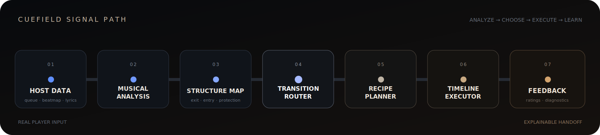

<p align="center">
  
</p>

<h1 align="center">Cuefield</h1>

<p align="center"><strong>An explainable AutoMix engine for real music players.</strong></p>

<p align="center">
  
  
  
  
  
</p>

<p align="center">
  <a href="#why-cuefield">Why Cuefield</a> ·
  <a href="#how-it-works">Signal path</a> ·
  <a href="#11-transition-recipes">Recipes</a> ·
  <a href="#engineering-evidence">Evidence</a> ·
  <a href="#offline-preview-cli">Preview CLI</a>
</p>

Cuefield reads structural evidence from two tracks, chooses a guarded DJ transition recipe, and executes the handoff inside [Mineradio](https://github.com/XxHuberrr/Mineradio). Every decision stays inspectable: route, anchors, recipe, timeline, fallbacks, and listening feedback.

> Free, non-commercial portfolio engineering project. Cuefield does not ship music, playback URLs, account cookies, or private listening data.

## 中文速览

Cuefield 是嵌入 Mineradio 的自动 DJ 过渡引擎。它读取节拍、重拍、能量窗口、调性与旋律轮廓，判断两首歌应该在哪里交接、适合哪种过渡配方，再由双 Deck runtime 执行。这个仓库展示的是可解释的音乐分析、路由、配方和失败降级系统；Mineradio 是验证它的真实播放器宿主。

## Why Cuefield

A fixed crossfade knows duration. Cuefield knows why a handoff is allowed.

- **It listens for structure.** Beat grids, downbeats, phrase candidates, energy windows, key evidence, melody contour, lyrics, and local musical compatibility shape the transition window.
- **It chooses a route before a sound.** `structure-mix`, `late-contrast-rise`, `late-contrast-release`, and `terminal-rescue` constrain where and how a recipe may run.
- **It fails closed.** Missing structure, unsafe overlap, vocal interruption, bass collision, stale queue state, or late runtime actions trigger rejection, downgrade, or a protected fallback.

## How It Works



| Stage | Responsibility | Implementation |
| --- | --- | --- |
| Host data | Read queue state, track identity, lyrics, and Mineradio beatmap cache | [`cuefield/adapter-mineradio.js`](./cuefield/adapter-mineradio.js) |
| Musical analysis | Normalize rhythm evidence and derive compact musical profiles | [`cuefield/musical-profile.js`](./cuefield/musical-profile.js) |
| Structure map | Locate protected exits, entries, releases, hooks, and local windows | [`cuefield/structure-map.js`](./cuefield/structure-map.js) · [`cuefield/section-candidates.js`](./cuefield/section-candidates.js) |
| Transition router | Select a compatible, rising, falling, or rescue route | [`cuefield/transition-router.js`](./cuefield/transition-router.js) |
| Recipe planner | Score eligible recipes and reject unsafe candidates | [`cuefield/recipe-planner.js`](./cuefield/recipe-planner.js) |
| Timeline executor | Schedule Deck A/B playback, EQ, filters, loops, echo, ducking, and handoff | [`public/cuefield-timeline-executor.js`](./public/cuefield-timeline-executor.js) |
| Feedback | Store compact ratings and diagnostics without audio URLs | [`cuefield/feedback-log.js`](./cuefield/feedback-log.js) |

### Route policy

| Route | When it is used | Window policy |
| --- | --- | --- |
| `structure-mix` | Compatible tracks with usable structural evidence | Adaptive overlap at the best supported exit and entry |
| `late-contrast-rise` | B enters with a strong snap or energy rise | Late exit, short filtered runway |
| `late-contrast-release` | A releases into a quieter or lower-energy B | Late exit, short or medium quiet runway |
| `terminal-rescue` | Structure, duration, tempo, or runway evidence is unsafe | Protected late fallback with bounded execution |

## 11 Transition Recipes

The planner creates candidates, scores their evidence, applies route and safety gates, then emits one executable timeline. A recipe name describes sound design; the router still controls whether that sound is allowed for the pair.

| Recipe | What it does | Guardrail or fallback |
| --- | --- | --- |
| `safety-long-blend` | Uses a conservative intro or low-density entry with delayed low end | Universal fallback for weak or rejected pairs; masks risky bass and aggressive intros |
| `intro-outro-long-blend` | Beds B's intro under a supported A outro before the anchor | Requires enough safe overlap; flags weak bass compatibility |
| `filtered-pickup` | Introduces B through a high-pass filter before its downbeat | Shortens for rising contrast and clears A's low end before handoff |
| `bass-eq-handoff` | Exchanges bass ownership instead of stacking both low ends | Ducks A and restores B's bass around the landing |
| `spectral-emergence` | Reveals B in three spectrum stages before the full mix arrives | Limited to structure-supported, musically compatible overlaps; carries a safety timeline |
| `quick-safe-fade` | Performs a short, bounded handoff when sustained overlap is risky | Keeps the transition brief and avoids unsupported effects |
| `echo-out` | Sends A into a controlled echo tail while B enters on a short runway | Requires usable Web Audio execution; falls back to a short safety timeline |
| `source-loop-roll` | Tightens A from four beats to two to one before release | Requires stable source looping and slip-safe cleanup |
| `hook-teaser` | Previews an isolated B hook, clears it, then returns for the final entry | Requires a trusted hook; carries a safety fallback |
| `harmonic-double-drop` | Lands matched A and B hooks together with immediate bass exchange | Local harmonic clash removes the candidate; intended for high-confidence pairs |
| `tease-roll-double-drop` | Combines a B teaser, an A loop roll, a brief fake-out, and a double drop | Requires trusted impact evidence, observes recipe cooldown, and falls back to `bass-eq-handoff` |

## Engineering Evidence

Baseline measured on public `main` at commit [`643b955`](https://github.com/SLYysl/cuefield-mineradio/commit/643b955):

| Evidence | Current baseline | How to reproduce |
| --- | ---: | --- |
| Transition recipes | 11 | Inspect `baseCandidate(...)` IDs in [`recipe-planner.js`](./cuefield/recipe-planner.js) |
| Automated tests | 398 passing, 0 failing | `node --test test/*.test.js` |
| Cuefield core + browser runtime | 7,646 lines | `git ls-files -z 'cuefield/*.js' 'public/cuefield*.js' \| xargs -0 wc -l` |
| Test code | 9,105 lines | `git ls-files -z 'test/*.js' \| xargs -0 wc -l` |
| Public repository history | 209 commits | `git rev-list --count 643b955` |

The original listening checkpoint covered 57 real playlist transitions: `54 positive / 2 neutral / 1 negative`, a 94.7% positive rate for the then-current `safety-long-blend` path. That number is a historical listening checkpoint, not model accuracy and not a claim that every current recipe passes at 94.7%.

### What the tests protect

- Queue identity, stale preparation, concurrent preparation, and handoff lifecycle
- Protected listening floors, lyric boundaries, structural anchors, and effective source end
- Beat/downbeat alignment, local musical compatibility, vocal collision, and bass clash
- Recipe eligibility, cooldown, route constraints, fallbacks, and volume-only downgrades
- Compact feedback records that strip audio URLs, raw lyrics, and bulk musical profiles
- Offline preview plans and ffmpeg argument construction

## Architecture & Repository Map

```text
cuefield-mineradio/
├── cuefield/                 analysis, routing, recipes, evaluation, preview rendering
├── public/
│   ├── cuefield-automix.js   player integration and preparation lifecycle
│   └── cuefield-*.js         Deck A/B execution, buffering, source loops, feedback UI
├── test/                     planner, runtime, safety, privacy, and integration tests
├── docs/                     design records, listening checkpoints, and project boundaries
├── server.js                 Mineradio host API and Cuefield endpoints
└── public/index.html         real Electron player UI host
```

Cuefield currently lives in a Mineradio fork because AutoMix needs a real queue, player clock, audio graph, and UI runtime. The intended boundary is still clean: Mineradio owns playback and presentation; Cuefield owns analysis, transition choice, execution timeline, and feedback diagnostics.

## Offline Preview CLI

Cuefield can render transition plans through ffmpeg before they enter the live player. Supply your own local audio, fixture data, and evaluation report:

```bash
node cuefield/render-preview-cli.js \
  --report /path/to/cuefield-eval.tsv \
  --row 1 \
  --mode bass-swap \
  --audio-dir /path/to/local-audio \
  --fixtures-dir /path/to/track-fixtures \
  --out /tmp/cuefield-previews
```

Useful options include `--full`, `--auto-sections`, `--lrc-dir`, and `--exit-bias`. The CLI writes an MP3 preview and prints the chosen mode, track pair, recipe, section choice, and segment durations as JSON.

The repository contains no demo songs. Preview inputs must be music you are authorized to use locally.

## Safety & Data Boundary

Cuefield keeps the public repository useful without turning listening sessions into a data leak.

**Never committed:**

- Music files or rendered previews
- Account cookies or authentication files
- Playback URLs
- Raw Mineradio beatmap cache
- Raw lyrics collected for a listening session
- Private feedback JSONL or remote feedback credentials

**Allowed public evidence:**

- Compact fixtures created for tests
- Aggregate listening counts
- Bounded diagnostics such as recipe, route, timing class, score tier, and rejection reason
- Code and tests that show how raw inputs are reduced or discarded

See [`PRIVACY.md`](./PRIVACY.md) and the Cuefield MVP handoff in [`docs/CUEFIELD_MVP.md`](./docs/CUEFIELD_MVP.md).

## Mineradio: The Real-World Host

[Mineradio](https://github.com/XxHuberrr/Mineradio) is a Windows Electron music player created by **XxHuberrr**. It supplies the real queue, playback engine, beatmap cache, lyrics, and UI environment used to test Cuefield. Cuefield does not replace Mineradio or redistribute it as a separate player.

This repository is not affiliated with NetEase Cloud Music, QQ Music, Tencent Music Entertainment, or their parent companies. Third-party service access remains subject to each platform's terms, copyright rules, and account entitlements.

## License & Attribution

Code is available under [GPL-3.0](./LICENSE). Mineradio, its name, and its original visual system remain attributed to XxHuberrr. The metallic Möbius showcase artwork was supplied by the repository maintainer for this public presentation.
